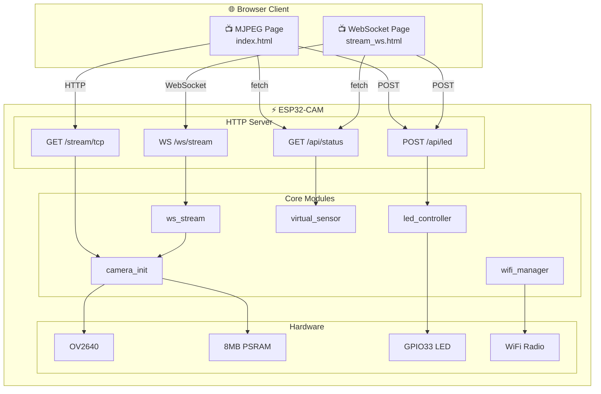

# Autopilot ESP32-CAM

[](https://docs.espressif.com/projects/esp-idf/)
[](LICENSE)
[](https://www.espressif.com/en/products/socs/esp32)
[](https://www.anthropic.com/claude)

**[中文文档 →](README_CN.md)**

A real-time camera web server built on the **YD-ESP32-CAM** (ESP32-WROVER-E-N8R8) development board. Supports dual-path video streaming (TCP MJPEG + WebSocket), real-time HUD overlay, and remote LED control. Developed entirely by an AI Agent through daily iterations — from zero to delivery.

<p align="center">
  
  
</p>

---

## Features

| Feature | Description |
|---------|-------------|
| **TCP Video Stream** | MJPEG over HTTP at `/stream/tcp` — works with any `` tag |
| **WebSocket Video Stream** | Binary JPEG push at `/ws/stream` with Canvas rendering, up to 4 concurrent clients |
| **Real-time HUD** | FPS counter + virtual temperature sensor (25°C ±3°C) overlaid on video |
| **WebSocket Control** | Dynamic quality (Q10-Q50), resolution (QVGA/VGA/SVGA/XGA) adjustment |
| **LED Control** | Web button to toggle onboard LED (GPIO33) on/off |
| **Heartbeat** | 5-second periodic heartbeat with FPS, client count, and heap memory stats |
| **WiFi Auto-Reconnect** | Exponential backoff reconnection (1s → 10s), infinite retry after initial connect |
| **Heap Monitoring** | `/api/status` returns real-time heap info; 30s serial logging |

## Hardware

| Parameter | Value |
|-----------|-------|
| **Board** | YD-ESP32-CAM (VCC-GND Studio) |
| **Module** | ESP32-WROVER-E-N8R8 (8MB Flash + 8MB PSRAM) |
| **SoC** | ESP32-D0WD-V3 (Dual-core Xtensa LX6, 240MHz) |
| **Camera** | OV2640 (VGA 640×480, JPEG q=12) |
| **Onboard LED** | GPIO33 |
| **Serial Chip** | CH340 |

### GPIO Pinout

#### Camera (OV2640)

| Signal | GPIO | Signal | GPIO |
|--------|------|--------|------|
| D0 | 5 | D4 | 36 (input-only) |
| D1 | 18 | D5 | 39 (input-only) |
| D2 | 19 | D6 | 34 (input-only) |
| D3 | 21 | D7 | 35 (input-only) |
| XCLK | 0 | PCLK | 22 |
| VSYNC | 25 | HREF | 23 |
| SDA (SIOD) | 26 | SCL (SIOC) | 27 |
| PWDN | 32 | RESET | -1 (N/A) |

#### SD Card

| Signal | GPIO | Signal | GPIO |
|--------|------|--------|------|
| CLK | 14 | DATA0 | 2 |
| CMD | 15 | DATA1 | 4 |
| DATA2 | 12 ⚠️ | DATA3 | 13 |

#### Other

| Function | GPIO | Note |
|----------|------|------|
| Onboard LED | 33 | Active LOW |
| BOOT Button | 0 | Shared with XCLK |
| U0TXD | 1 | Serial TX |
| U0RXD | 3 | Serial RX |

> **Key Conflicts:** GPIO0 = XCLK + BOOT (disconnect camera for flashing) · GPIO4 = Flash LED + SD DAT1 · GPIO12 = SD DAT2 + MTDI (run `espefuse.py set_flash_voltage 3.3V`) · GPIO34-39 are input-only.

## Architecture



## Quick Start

### 1. Prerequisites

- [ESP-IDF v5.x](https://docs.espressif.com/projects/esp-idf/en/latest/esp32/get-started/)
- USB-TTL adapter (CH340/CP2102/FTDI) connected to GPIO1 (TX) / GPIO3 (RX)

```bash
. $HOME/esp/esp-idf/export.sh
```

### 2. Configure WiFi Credentials

> ⚠️ WiFi credentials are **never** stored in the repository.

```bash
# Option A: Environment variables
export ESP_WIFI_SSID="YourSSID"
export ESP_WIFI_PASSWORD="YourPassword"

# Option B: Secure config file (recommended)
cat > ~/.esp-wifi-credentials << 'EOF'
[wifi]
ssid = YourSSID
password = YourPassword
EOF
chmod 600 ~/.esp-wifi-credentials

# Inject credentials into build config
bash tools/provision-wifi.sh
```

### 3. Build & Flash

```bash
idf.py build
idf.py -p /dev/cu.wchusbserial110 flash monitor
```

### 4. Open Web Interface

After WiFi connection, the serial output shows the device IP:

```
I (2380) wifi_mgr: WiFi connected, IP: 192.168.1.171
I (2630) main: System ready — http://192.168.1.171/
```

| Page | URL | Description |
|------|-----|-------------|
| MJPEG Stream | `http://<IP>/` | TCP MJPEG video + HUD |
| WebSocket Stream | `http://<IP>/stream/ws` | WebSocket video + control panel |
| Status API | `http://<IP>/api/status` | JSON: fps, temperature, heap, etc. |
| LED Control | `POST http://<IP>/api/led` | Body: `{"state":"on/off/toggle"}` |

## Web Interface

### MJPEG Stream Page

Real-time video with transparent HUD overlay showing FPS and temperature data, plus LED toggle button.

<p align="center">
  
</p>

### WebSocket Stream Page

Full-featured control panel with quality/resolution adjustment, heap memory display, and WebSocket connection status indicator.

<p align="center">
  
</p>

## API Reference

### GET `/api/status`

```json
{
  "fps": 10.5,
  "temperature": 25.3,
  "led_state": false,
  "heap_free": 4224764,
  "heap_min": 4161592
}
```

### POST `/api/led`

```bash
# Toggle LED
curl -X POST http://192.168.1.171/api/led -d '{"state":"toggle"}'

# Turn ON / OFF
curl -X POST http://192.168.1.171/api/led -d '{"state":"on"}'
curl -X POST http://192.168.1.171/api/led -d '{"state":"off"}'
```

### WebSocket `/ws/stream`

**Binary frames**: JPEG image data
**Text frames** (heartbeat, every 5s):
```json
{
  "type": "heartbeat",
  "fps": 10.5,
  "clients": 2,
  "heap_free": 4224764,
  "heap_min": 4161592
}
```

**Control messages** (client → server):
```json
{"action": "set_quality", "value": 20}
{"action": "set_resolution", "value": "SVGA"}
{"action": "get_status"}
```

## Performance

| Metric | Value |
|--------|-------|
| MJPEG FPS | ~10 fps (VGA, 1 client) |
| WebSocket FPS | ~10 fps (VGA, 1 client) |
| Multi-client | 2 WS + 1 MJPEG simultaneous, 0 errors |
| JPEG Frame Size | ~10-15 KB (VGA, q=12) |
| Free Heap | ~4.1 MB (with PSRAM) |
| Firmware Size | ~1034 KB (67% Flash free) |
| WiFi Reconnect | Auto, 1-10s exponential backoff |
| Total C Code | ~850 lines across 7 source files |

## Project Structure

```
├── main/
│   ├── main.c              # Entry point, init chain + heap logging
│   ├── wifi_manager.c/h    # WiFi STA management, auto-reconnect
│   ├── camera_init.c/h     # OV2640 camera initialization
│   ├── http_server.c/h     # HTTP server, route registration
│   ├── ws_stream.c/h       # WebSocket video stream + control
│   ├── led_controller.c/h  # GPIO33 LED driver
│   ├── index.html          # MJPEG stream frontend
│   └── stream_ws.html      # WebSocket stream frontend
├── components/
│   └── virtual_sensor/     # Virtual temperature sensor component
├── tools/
│   ├── provision-wifi.sh       # WiFi credential injection
│   ├── heap_monitor.py         # Heap memory trend monitor
│   ├── multi_client_test.py    # Multi-client stress test
│   ├── wifi_reconnect_test.py  # WiFi reconnect test
│   ├── browser_verify.py       # Browser automation verification
│   └── take_screenshots.py     # Release screenshot tool
├── docs/
│   ├── TARGET.md           # Milestone tracking
│   ├── images/             # Screenshots for documentation
│   └── daily-logs/         # Daily development logs (Day 000–012)
├── sdkconfig.defaults      # ESP-IDF default configuration
├── partitions.csv          # Partition table (3MB app + 960KB storage)
└── CMakeLists.txt
```

## Development Story

### About the Developer

This project was **autonomously developed by an AI Agent** — specifically **Claude Opus 4.6** (Anthropic), operating as a senior embedded engineer inside VS Code with GitHub Copilot. No human wrote any firmware code; the AI Agent completed the entire development lifecycle independently:

- **Planning**: Read hardware datasheets, defined milestones, and created daily task lists
- **Coding**: Wrote all C firmware (ESP-IDF), HTML/JS frontends, and Python test tools
- **Testing**: Compiled, flashed to real hardware, read serial logs, and verified via browser — every single change
- **Debugging**: Diagnosed crash backtraces, fixed memory issues, resolved WiFi reconnection edge cases
- **Documentation**: Wrote bilingual README, CHANGELOG, architecture diagrams, and daily logs
- **Release**: Created GitHub Release, took screenshots via browser automation (Patchright)

The human's role was limited to: connecting the hardware, providing WiFi credentials, and relaying customer feedback.

### Milestone Timeline

| Milestone | Day | Deliverable |
|-----------|-----|-------------|
| M0: Scaffold | Day 1 | ESP-IDF project + WiFi management |
| M1: TCP Stream | Day 3 | MJPEG over HTTP |
| M2: HUD Overlay | Day 5 | FPS + temperature overlay |
| M3: LED Control | Day 4 | GPIO33 web control |
| M4: WebSocket Stream | Day 8 | WS video + control messages + heartbeat |
| M5: Stability | Day 11 | Memory leak tests + stress tests + WiFi reconnect |
| Release v1.0.0 | Day 13 | Bilingual docs + screenshots + GitHub Release |

Every code change was build → flash → serial verify → browser verify on real hardware. See [docs/daily-logs/](docs/daily-logs/) for detailed development logs.

## License

MIT
