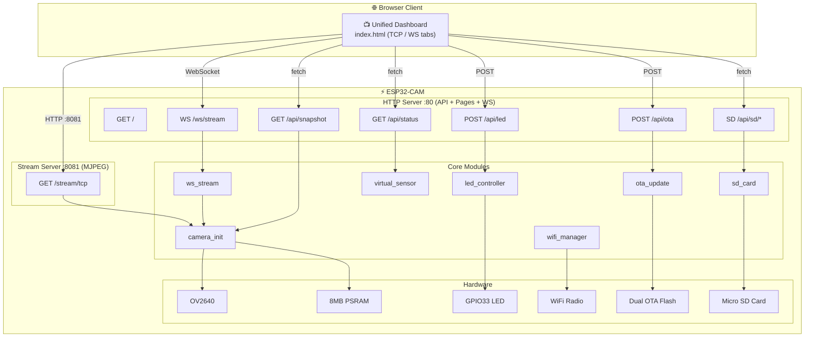

# Autopilot ESP32-CAM

[](https://github.com/chinawrj/Autopilot-ESP32-CAM/actions/workflows/ci.yml)
[](https://docs.espressif.com/projects/esp-idf/)
[](LICENSE)
[](https://www.espressif.com/en/products/socs/esp32)
[](https://www.anthropic.com/claude)

**[中文文档 →](README_CN.md)**

A real-time camera web server built on the **YD-ESP32-CAM** (ESP32-WROVER-E-N8R8) development board. Supports dual-path video streaming (TCP MJPEG + WebSocket), real-time HUD overlay, SD card storage, OTA firmware updates, and comprehensive system diagnostics. Developed entirely by an AI Agent through daily iterations — from zero to delivery.

<p align="center">
  
  
</p>

---

## Features

| Feature | Description |
|---------|-------------|
| **TCP Video Stream** | MJPEG over HTTP at `/stream/tcp` — works with any `` tag |
| **WebSocket Video Stream** | Binary JPEG push at `/ws/stream` with Canvas rendering, up to 4 concurrent clients |
| **Real-time HUD** | FPS counter + virtual temperature sensor (25°C ±3°C) overlaid on video |
| **WebSocket Control** | Dynamic quality (Q10-Q50), resolution (QVGA/VGA/SVGA/XGA) adjustment |
| **LED Control** | Web button to toggle onboard LED (GPIO33) on/off |
| **OTA Firmware Update** | Over-the-air upgrade via `POST /api/ota` with progress tracking and rollback protection |
| **Snapshot API** | `GET /api/snapshot` returns a single JPEG frame for capture/download |
| **Unified Dashboard** | Single-page UI with tab switching (TCP / WebSocket), all controls on one page |
| **Camera Settings** | Real-time camera parameter adjustment (brightness, contrast, saturation, mirror, flip) via `/api/camera` |
| **SD Card Storage** | Micro SD card support: capture JPEG to SD, browse/download/delete files via `/api/sd/*` |
| **System Diagnostics** | `/api/system/info` with chip info, memory stats, health status, WiFi RSSI |
| **Task Watchdog** | Hardware watchdog timer (30s) with automatic reboot on hang |
| **Heap Monitoring** | Periodic heap integrity checks, low memory warnings, health API |
| **Rate Limiting** | OTA and SD delete endpoints rate-limited to prevent abuse |
| **Path Security** | SD card file access sanitized against path traversal attacks |
| **WiFi Auto-Reconnect** | Exponential backoff reconnection (1s → 10s), infinite retry after initial connect |
| **mDNS Discovery** | Access via `http://espcam.local/` — no need to remember IP addresses |
| **Integration Tests** | 39 browser-based tests + 50 unit tests covering all endpoints |
| **Heartbeat** | 5-second periodic heartbeat with FPS, client count, and heap memory stats |

## Hardware

| Parameter | Value |
|-----------|-------|
| **Board** | YD-ESP32-CAM (VCC-GND Studio) |
| **Module** | ESP32-WROVER-E-N8R8 (8MB Flash + 8MB PSRAM) |
| **SoC** | ESP32-D0WD-V3 (Dual-core Xtensa LX6, 240MHz) |
| **Camera** | OV2640 (VGA 640×480, JPEG q=12) |
| **Onboard LED** | GPIO33 |
| **Serial Chip** | CH340 |

### GPIO Pinout

#### Camera (OV2640)

| Signal | GPIO | Signal | GPIO |
|--------|------|--------|------|
| D0 | 5 | D4 | 36 (input-only) |
| D1 | 18 | D5 | 39 (input-only) |
| D2 | 19 | D6 | 34 (input-only) |
| D3 | 21 | D7 | 35 (input-only) |
| XCLK | 0 | PCLK | 22 |
| VSYNC | 25 | HREF | 23 |
| SDA (SIOD) | 26 | SCL (SIOC) | 27 |
| PWDN | 32 | RESET | -1 (N/A) |

#### SD Card

| Signal | GPIO | Signal | GPIO |
|--------|------|--------|------|
| CLK | 14 | DATA0 | 2 |
| CMD | 15 | DATA1 | 4 |
| DATA2 | 12 ⚠️ | DATA3 | 13 |

#### Other

| Function | GPIO | Note |
|----------|------|------|
| Onboard LED | 33 | Active LOW |
| BOOT Button | 0 | Shared with XCLK |
| U0TXD | 1 | Serial TX |
| U0RXD | 3 | Serial RX |

> **Key Conflicts:** GPIO0 = XCLK + BOOT (disconnect camera for flashing) · GPIO4 = Flash LED + SD DAT1 · GPIO12 = SD DAT2 + MTDI (run `espefuse.py set_flash_voltage 3.3V`) · GPIO34-39 are input-only.

## Architecture



## Quick Start

### 1. Prerequisites

- [ESP-IDF v5.x](https://docs.espressif.com/projects/esp-idf/en/latest/esp32/get-started/)
- USB-TTL adapter (CH340/CP2102/FTDI) connected to GPIO1 (TX) / GPIO3 (RX)

```bash
. $HOME/esp/esp-idf/export.sh
```

### 2. Configure WiFi Credentials

> ⚠️ WiFi credentials are **never** stored in the repository.

```bash
# Option A: Environment variables
export ESP_WIFI_SSID="YourSSID"
export ESP_WIFI_PASSWORD="YourPassword"

# Option B: Secure config file (recommended)
cat > ~/.esp-wifi-credentials << 'EOF'
[wifi]
ssid = YourSSID
password = YourPassword
EOF
chmod 600 ~/.esp-wifi-credentials

# Inject credentials into build config
bash tools/provision-wifi.sh
```

### 3. Build & Flash

```bash
idf.py build
idf.py -p /dev/cu.wchusbserial110 flash monitor
```

### 4. Open Web Interface

After WiFi connection, the serial output shows the device IP:

```
I (2380) wifi_mgr: WiFi connected, IP: 192.168.1.171
I (2630) main: System ready — http://192.168.1.171/
```

| Page | URL | Description |
|------|-----|-------------|
| Dashboard | `http://<IP>/` | Unified UI with TCP/WS tab switching |
| MJPEG Stream | `http://<IP>:8081/stream/tcp` | Direct MJPEG video (also embedded in dashboard) |
| Status API | `http://<IP>/api/status` | JSON: fps, temperature, heap, rssi, uptime |
| LED Control | `POST http://<IP>/api/led` | Body: `{"state":"on/off/toggle"}` |
| Snapshot | `http://<IP>/api/snapshot` | Single JPEG frame capture |
| OTA Update | `POST http://<IP>/api/ota` | Body: `{"url":"http://..."}` |
| OTA Status | `http://<IP>/api/ota/status` | OTA progress and state |
| SD Status | `http://<IP>/api/sd/status` | SD card mount state + capacity |
| SD File List | `http://<IP>/api/sd/list` | List files on SD card |
| SD Capture | `POST http://<IP>/api/sd/capture` | Capture JPEG to SD card |

## Web Interface

### Unified Dashboard

Single-page application with tab switching between TCP MJPEG and WebSocket streams. Includes HUD overlay (FPS + temperature), LED control, snapshot download, OTA firmware update, and system info panel.

<p align="center">
  
  
</p>

## API Reference

Full API documentation is available in **[docs/API.md](docs/API.md)**.

Quick reference for common operations:

```bash
# Toggle LED
curl -X POST http://<IP>/api/led -d '{"state":"toggle"}'

# Take snapshot
curl -o snapshot.jpg http://<IP>/api/snapshot

# Camera settings
curl http://<IP>/api/camera
curl -X POST http://<IP>/api/camera -d '{"brightness":1,"vflip":true}'

# System status
curl http://<IP>/api/status
curl http://<IP>/api/system/info

# SD card
curl http://<IP>/api/sd/status
curl http://<IP>/api/sd/list
curl -X POST http://<IP>/api/sd/capture

# OTA update
curl -X POST http://<IP>/api/ota -d '{"url":"http://server/firmware.bin"}'
```

### WebSocket `/ws/stream`

**Binary frames**: JPEG image data
**Text frames** (heartbeat, every 5s):
```json
{
  "type": "heartbeat",
  "fps": 10.5,
  "clients": 2,
  "heap_free": 4224764,
  "heap_min": 4161592
}
```

**Control messages** (client → server):
```json
{"action": "set_quality", "value": 20}
{"action": "set_resolution", "value": "SVGA"}
{"action": "get_status"}
```

## Performance

| Metric | Value |
|--------|-------|
| MJPEG FPS | ~10 fps (VGA, 1 client) |
| WebSocket FPS | ~10 fps (VGA, 1 client) |
| Multi-client | 3 WS + 1 MJPEG simultaneous, 0 errors |
| JPEG Frame Size | ~10-15 KB (VGA, q=12) |
| Free Heap | ~4.2 MB (with PSRAM) |
| Firmware Size | ~1.3 MB (59% partition free) |
| Partition Layout | Dual OTA (3MB × 2) + 1.97MB SPIFFS |
| WiFi Reconnect | Auto, 1-10s exponential backoff |
| Total C Code | ~1,700 lines across 14 source files |
| Browser Tests | 39 integration tests (Patchright) |
| Unit Tests | 50 host-based tests (5 suites, Unity) |

## Project Structure

```
├── main/
│   ├── main.c              # Entry point, watchdog + heap monitoring
│   ├── wifi_manager.c/h    # WiFi STA management, auto-reconnect
│   ├── camera_init.c/h     # OV2640 camera initialization + I2C recovery
│   ├── http_server.c/h     # HTTP server :80, API routes, WebSocket upgrade
│   ├── http_helpers.c/h    # JSON response helper with security headers
│   ├── camera_handlers.c/h # Camera GET/POST endpoint handlers
│   ├── stream_server.c/h   # Independent MJPEG stream server :8081
│   ├── ws_stream.c/h       # WebSocket video stream + control messages
│   ├── ota_update.c/h      # OTA firmware update with rollback protection
│   ├── led_controller.c/h  # GPIO33 LED driver
│   ├── sd_handlers.c/h     # SD card REST API (status, list, delete)
│   ├── sd_file_ops.c/h     # SD card file operations (capture, download)
│   ├── system_info.c/h     # System diagnostics + health API
│   ├── rate_limiter.c/h    # Generic token-bucket rate limiter
│   ├── path_utils.c/h      # Path sanitization for SD card security
│   ├── index.html          # Unified dashboard (TCP/WS tabs + all controls)
│   ├── app.js              # Frontend JavaScript (extracted, cacheable)
│   └── stream_ws.html      # WebSocket stream standalone page
├── components/
│   ├── virtual_sensor/     # Virtual temperature sensor component
│   ├── fps_counter/        # Reusable FPS calculation component
│   └── sd_card/            # SD card driver (1-bit SDMMC + VFS FAT)
├── test/
│   ├── unit/               # Unit tests (fps, sensor, led, path, rate_limiter)
│   ├── integration/        # Browser integration tests (39 tests, Patchright)
│   ├── mocks/              # ESP-IDF mock layer for host-based testing
│   └── CMakeLists.txt      # Host build: cmake && make && ctest
├── docs/
│   ├── API.md              # Full REST API documentation
│   ├── TARGET.md           # Milestone tracking
│   ├── images/             # Screenshots for documentation
│   └── daily-logs/         # Daily development logs
├── tools/                  # Python test & automation tools
├── CHANGELOG.md            # Version history
├── sdkconfig.defaults      # ESP-IDF default configuration
├── partitions.csv          # Partition table (dual OTA 3MB×2 + 1.97MB SPIFFS)
└── CMakeLists.txt
```

## Development Story

### About the Developer

This project was **autonomously developed by an AI Agent** — specifically **Claude Opus 4.6** (Anthropic), operating as a senior embedded engineer inside VS Code with GitHub Copilot. No human wrote any firmware code; the AI Agent completed the entire development lifecycle independently:

- **Planning**: Read hardware datasheets, defined milestones, and created daily task lists
- **Coding**: Wrote all C firmware (ESP-IDF), HTML/JS frontends, and Python test tools
- **Testing**: Compiled, flashed to real hardware, read serial logs, and verified via browser — every single change
- **Debugging**: Diagnosed crash backtraces, fixed memory issues, resolved WiFi reconnection edge cases
- **Documentation**: Wrote bilingual README, CHANGELOG, architecture diagrams, and daily logs
- **Release**: Created GitHub Release, took screenshots via browser automation (Patchright)

The human's role was limited to: connecting the hardware, providing WiFi credentials, and relaying customer feedback.

### Milestone Timeline

| Milestone | Day | Deliverable |
|-----------|-----|-------------|
| M0: Scaffold | Day 1 | ESP-IDF project + WiFi management |
| M1: TCP Stream | Day 3 | MJPEG over HTTP |
| M2: HUD Overlay | Day 5 | FPS + temperature overlay |
| M3: LED Control | Day 4 | GPIO33 web control |
| M4: WebSocket Stream | Day 8 | WS video + control messages + heartbeat |
| M5: Stability | Day 11 | Memory leak tests + stress tests + WiFi reconnect |
| Release v1.0.0 | Day 13 | Bilingual docs + screenshots + GitHub Release |
| M6: OTA + Dashboard | Day 18 | OTA update + snapshot + unified dashboard |
| Release v1.1.0 | Day 18 | Dual server architecture + OTA + unified UI |
| Quality Audit | Day 19 | 130/130 tests passed, port 81→8081 fix |
| Release v1.1.1 | Day 20 | Documentation refresh + patch release |
| Release v1.2.0 | Day 21 | mDNS discovery + Camera Settings API |
| Refactoring | Day 22 | FPS component + JSON helper + 20 unit tests |
| Release v1.3.0 | Day 23 | SD Card Storage + Unit Test framework |
| M7: Security & JS | Day 30 | JS extraction + rate limiting + path security |
| Release v1.4.0 | Day 30 | System diagnostics + security hardening |
| M8: Release Prep | Day 31-32 | Watchdog + heap monitoring + 39 browser tests |

Every code change was build → flash → serial verify → browser verify on real hardware. See [docs/daily-logs/](docs/daily-logs/) for detailed development logs.

## License

MIT
