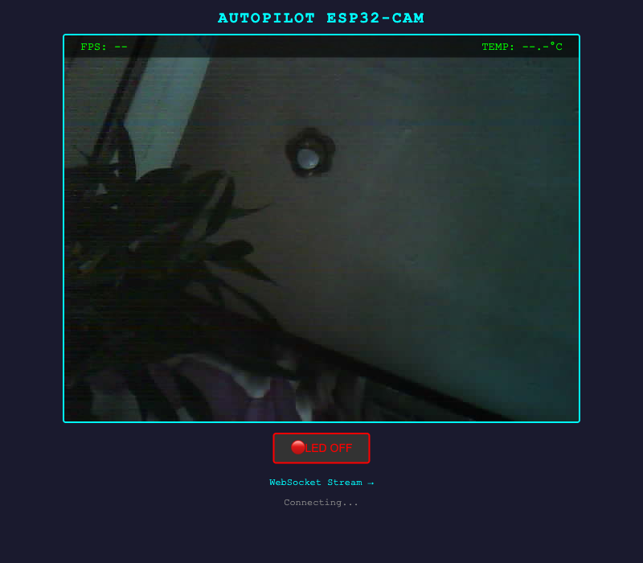
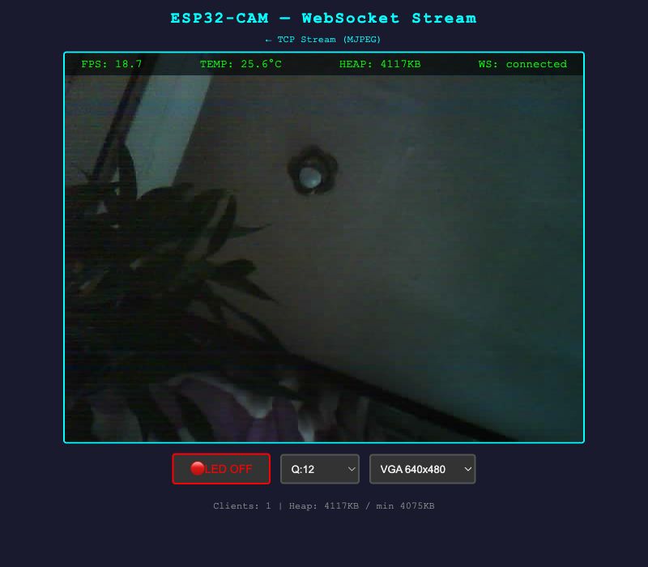
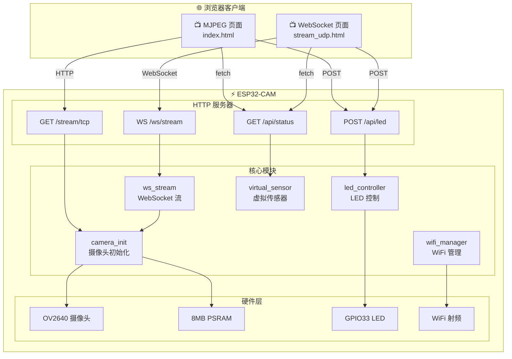

# Autopilot ESP32-CAM

[](https://docs.espressif.com/projects/esp-idf/)
[](LICENSE)
[](https://www.espressif.com/en/products/socs/esp32)

**[English Documentation →](README.md)**

基于 **YD-ESP32-CAM** (ESP32-WROVER-E-N8R8) 开发板的实时摄像头 Web 服务器。支持 TCP MJPEG + WebSocket 双路径视频流、实时 HUD 叠加显示、LED 远程控制。由 AI Agent 以每日迭代方式从零开发至交付。

<p align="center">
  
  
</p>

---

## 功能特性

| 功能 | 说明 |
|------|------|
| **TCP 视频流** | `/stream/tcp` — MJPEG over HTTP，浏览器 `` 标签直接播放 |
| **WebSocket 视频流** | `/ws/stream` — 二进制 JPEG 帧推送 + Canvas 渲染，最多 4 客户端并发 |
| **实时 HUD** | FPS 计数器 + 虚拟温度传感器 (25°C ±3°C)，叠加在视频画面上 |
| **WebSocket 控制** | 动态调整画质 (Q10-Q50)、分辨率 (QVGA/VGA/SVGA/XGA) |
| **LED 控制** | 网页按钮控制板载 LED (GPIO33) 开/关/切换 |
| **心跳机制** | 5 秒周期心跳，推送 FPS、客户端数、堆内存等状态 |
| **WiFi 自动重连** | 断线后指数退避无限重连 (1s → 10s) |
| **堆内存监控** | `/api/status` 返回实时堆内存信息，每 30s 串口日志输出 |

## 硬件参数

| 参数 | 值 |
|------|-----|
| **开发板** | YD-ESP32-CAM (源地工作室 VCC-GND Studio) |
| **核心模组** | ESP32-WROVER-E-N8R8 (8MB Flash + 8MB PSRAM) |
| **芯片** | ESP32-D0WD-V3 (双核 Xtensa LX6, 240MHz) |
| **摄像头** | OV2640 (VGA 640×480, JPEG q=12) |
| **板载 LED** | GPIO33 |
| **串口芯片** | CH340 |

## 系统架构



## 快速开始

### 1. 环境准备

- [ESP-IDF v5.x](https://docs.espressif.com/projects/esp-idf/zh_CN/latest/esp32/get-started/)
- USB 转串口模块 (CH340/CP2102/FTDI)，连接 GPIO1 (TX) / GPIO3 (RX)

```bash
. $HOME/esp/esp-idf/export.sh
```

### 2. 配置 WiFi 凭据

> ⚠️ WiFi 密码**绝不**存储在仓库中。

```bash
# 方式一：环境变量
export ESP_WIFI_SSID="你的WiFi名称"
export ESP_WIFI_PASSWORD="你的WiFi密码"

# 方式二：安全配置文件（推荐）
cat > ~/.esp-wifi-credentials << 'EOF'
[wifi]
ssid = 你的WiFi名称
password = 你的WiFi密码
EOF
chmod 600 ~/.esp-wifi-credentials

# 注入凭据到构建配置
bash tools/provision-wifi.sh
```

### 3. 编译与烧录

```bash
idf.py build
idf.py -p /dev/cu.wchusbserial110 flash monitor
```

### 4. 打开 Web 界面

设备连网后，串口输出 IP 地址：

```
I (2380) wifi_mgr: WiFi connected, IP: 192.168.1.171
I (2630) main: System ready — http://192.168.1.171/
```

| 页面 | URL | 说明 |
|------|-----|------|
| MJPEG 视频流 | `http://<IP>/` | TCP MJPEG 视频 + HUD |
| WebSocket 视频流 | `http://<IP>/stream/udp` | WebSocket 视频 + 控制面板 |
| 状态 API | `http://<IP>/api/status` | JSON: fps, temperature, heap 等 |
| LED 控制 | `POST http://<IP>/api/led` | Body: `{"state":"on/off/toggle"}` |

## Web 界面

### MJPEG 视频流页面

实时视频流，半透明 HUD 叠加显示 FPS 和温度数据，配有 LED 切换按钮。

<p align="center">
  
</p>

### WebSocket 视频流页面

功能完整的控制面板：画质/分辨率调整、堆内存显示、WebSocket 连接状态指示。

<p align="center">
  
</p>

## API 接口

### GET `/api/status`

```json
{
  "fps": 10.5,
  "temperature": 25.3,
  "led_state": false,
  "heap_free": 4224764,
  "heap_min": 4161592
}
```

### POST `/api/led`

```bash
# 切换 LED
curl -X POST http://192.168.1.171/api/led -d '{"state":"toggle"}'

# 开启 / 关闭
curl -X POST http://192.168.1.171/api/led -d '{"state":"on"}'
curl -X POST http://192.168.1.171/api/led -d '{"state":"off"}'
```

### WebSocket `/ws/stream`

**二进制帧**: JPEG 图像数据
**文本帧**（心跳，每 5 秒）：
```json
{
  "type": "heartbeat",
  "fps": 10.5,
  "clients": 2,
  "heap_free": 4224764,
  "heap_min": 4161592
}
```

**控制消息**（客户端 → 服务器）：
```json
{"action": "set_quality", "value": 20}
{"action": "set_resolution", "value": "SVGA"}
{"action": "get_status"}
```

## 性能指标

| 指标 | 值 |
|------|-----|
| MJPEG 帧率 | ~10 fps (VGA, 单客户端) |
| WebSocket 帧率 | ~10 fps (VGA, 单客户端) |
| 多客户端 | 2 WS + 1 MJPEG 同时运行，0 错误 |
| JPEG 帧大小 | ~10-15 KB (VGA, q=12) |
| 空闲堆内存 | ~4.1 MB (含 PSRAM) |
| 固件大小 | ~1034 KB (Flash 67% 空闲) |
| WiFi 重连 | 自动，1-10s 指数退避 |
| C 代码总量 | ~850 行，7 个源文件 |

## 项目结构

```
├── main/
│   ├── main.c              # 入口，初始化链 + 堆日志
│   ├── wifi_manager.c/h    # WiFi STA 管理，自动重连
│   ├── camera_init.c/h     # OV2640 摄像头初始化
│   ├── http_server.c/h     # HTTP 服务器，路由注册
│   ├── ws_stream.c/h       # WebSocket 视频流 + 控制消息
│   ├── led_controller.c/h  # GPIO33 LED 驱动
│   ├── index.html          # MJPEG 视频流前端页面
│   └── stream_udp.html     # WebSocket 视频流前端页面
├── components/
│   └── virtual_sensor/     # 虚拟温度传感器组件
├── tools/
│   ├── provision-wifi.sh       # WiFi 凭据安全注入
│   ├── heap_monitor.py         # 堆内存趋势监控
│   ├── multi_client_test.py    # 多客户端并发压力测试
│   ├── wifi_reconnect_test.py  # WiFi 重连测试
│   ├── browser_verify.py       # 浏览器自动化验证
│   └── take_screenshots.py     # Release 截图工具
├── docs/
│   ├── TARGET.md           # 里程碑进度跟踪
│   ├── images/             # 文档截图
│   └── daily-logs/         # 每日开发日志 (Day 000–012)
├── sdkconfig.defaults      # ESP-IDF 默认配置
├── partitions.csv          # 分区表 (3MB app + 960KB storage)
└── CMakeLists.txt
```

## 开发历程

本项目由 AI Agent 扮演资深嵌入式工程师，通过每日迭代方式从零开发至交付完成：

| 里程碑 | 完成日 | 交付内容 |
|--------|--------|----------|
| M0: 项目脚手架 | Day 1 | ESP-IDF 项目结构 + WiFi 管理 |
| M1: TCP 视频流 | Day 3 | MJPEG over HTTP |
| M2: HUD 叠加 | Day 5 | FPS + 温度叠加显示 |
| M3: LED 控制 | Day 4 | GPIO33 网页控制 |
| M4: WebSocket 流 | Day 8 | WS 视频 + 控制消息 + 心跳 |
| M5: 稳定性优化 | Day 11 | 内存泄漏测试 + 压力测试 + WiFi 重连 |
| Release 准备 | Day 12 | 中英双语文档 + 截图 + 架构图 |

每次代码变更都经过完整的 编译 → 烧录 → 串口验证 → 浏览器验证 循环。详细日志见 [docs/daily-logs/](docs/daily-logs/)。

## 许可证

MIT
