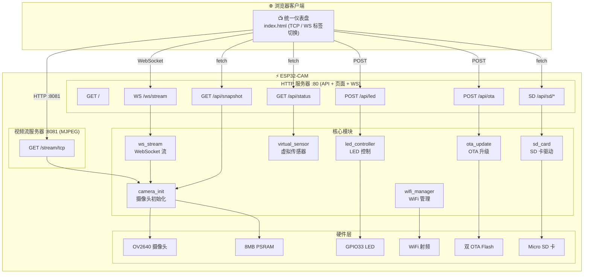

# Autopilot ESP32-CAM

[](https://github.com/chinawrj/Autopilot-ESP32-CAM/actions/workflows/ci.yml)
[](https://docs.espressif.com/projects/esp-idf/)
[](LICENSE)
[](https://www.espressif.com/en/products/socs/esp32)
[](https://www.anthropic.com/claude)

**[English Documentation →](README.md)**

基于 **YD-ESP32-CAM** (ESP32-WROVER-E-N8R8) 开发板的实时摄像头 Web 服务器。支持 TCP MJPEG + WebSocket 双路径视频流、实时 HUD 叠加显示、LED 远程控制。由 AI Agent 以每日迭代方式从零开发至交付。

<p align="center">
  
  
</p>

---

## 功能特性

| 功能 | 说明 |
|------|------|
| **TCP 视频流** | `/stream/tcp` — MJPEG over HTTP，浏览器 `` 标签直接播放 |
| **WebSocket 视频流** | `/ws/stream` — 二进制 JPEG 帧推送 + Canvas 渲染，最多 4 客户端并发 |
| **实时 HUD** | FPS 计数器 + 虚拟温度传感器 (25°C ±3°C)，叠加在视频画面上 |
| **WebSocket 控制** | 动态调整画质 (Q10-Q50)、分辨率 (QVGA/VGA/SVGA/XGA) |
| **LED 控制** | 网页按钮控制板载 LED (GPIO33) 开/关/切换 |
| **OTA 固件升级** | 通过 `POST /api/ota` 远程升级固件，支持进度跟踪和回滚保护 |
| **快照 API** | `GET /api/snapshot` 返回单帧 JPEG 图像，支持下载 |
| **统一仪表盘** | 单页面 UI，TCP / WebSocket 标签切换，所有控制集于一页 |
| **心跳机制** | 5 秒周期心跳，推送 FPS、客户端数、堆内存等状态 |
| **WiFi 自动重连** | 断线后指数退避无限重连 (1s → 10s) |
| **mDNS 发现** | 通过 `http://espcam.local/` 访问设备 — 无需记住 IP 地址 |
| **摄像头设置** | 实时调节摄像头参数（亮度、对比度、饱和度、镜像、翻转）via `/api/camera` |
| **SD 卡存储** | Micro SD 卡支持：拍照存 SD 卡、浏览/下载/删除文件 via `/api/sd/*` |
| **单元测试** | 20 个基于主机的单元测试（fps_counter、virtual_sensor、led_controller），Unity 框架 |
| **堆内存监控** | `/api/status` 返回实时堆内存、RSSI、运行时间信息，每 30s 串口日志输出 |

## 硬件参数

| 参数 | 值 |
|------|-----|
| **开发板** | YD-ESP32-CAM (源地工作室 VCC-GND Studio) |
| **核心模组** | ESP32-WROVER-E-N8R8 (8MB Flash + 8MB PSRAM) |
| **芯片** | ESP32-D0WD-V3 (双核 Xtensa LX6, 240MHz) |
| **摄像头** | OV2640 (VGA 640×480, JPEG q=12) |
| **板载 LED** | GPIO33 |
| **串口芯片** | CH340 |

### GPIO 引脚定义

#### 摄像头 (OV2640)

| 信号 | GPIO | 信号 | GPIO |
|------|------|------|------|
| D0 | 5 | D4 | 36 (仅输入) |
| D1 | 18 | D5 | 39 (仅输入) |
| D2 | 19 | D6 | 34 (仅输入) |
| D3 | 21 | D7 | 35 (仅输入) |
| XCLK | 0 | PCLK | 22 |
| VSYNC | 25 | HREF | 23 |
| SDA (SIOD) | 26 | SCL (SIOC) | 27 |
| PWDN | 32 | RESET | -1 (无) |

#### SD 卡

| 信号 | GPIO | 信号 | GPIO |
|------|------|------|------|
| CLK | 14 | DATA0 | 2 |
| CMD | 15 | DATA1 | 4 |
| DATA2 | 12 ⚠️ | DATA3 | 13 |

#### 其他引脚

| 功能 | GPIO | 备注 |
|------|------|------|
| 板载 LED | 33 | 低电平有效 |
| BOOT 按键 | 0 | 与 XCLK 共用 |
| U0TXD | 1 | 串口 TX |
| U0RXD | 3 | 串口 RX |

> **关键冲突：** GPIO0 = XCLK + BOOT（烧录时需断开摄像头）· GPIO4 = Flash LED + SD DAT1 · GPIO12 = SD DAT2 + MTDI（需执行 `espefuse.py set_flash_voltage 3.3V`）· GPIO34-39 仅支持输入。

## 系统架构



## 快速开始

### 1. 环境准备

- [ESP-IDF v5.x](https://docs.espressif.com/projects/esp-idf/zh_CN/latest/esp32/get-started/)
- USB 转串口模块 (CH340/CP2102/FTDI)，连接 GPIO1 (TX) / GPIO3 (RX)

```bash
. $HOME/esp/esp-idf/export.sh
```

### 2. 配置 WiFi 凭据

> ⚠️ WiFi 密码**绝不**存储在仓库中。

```bash
# 方式一：环境变量
export ESP_WIFI_SSID="你的WiFi名称"
export ESP_WIFI_PASSWORD="你的WiFi密码"

# 方式二：安全配置文件（推荐）
cat > ~/.esp-wifi-credentials << 'EOF'
[wifi]
ssid = 你的WiFi名称
password = 你的WiFi密码
EOF
chmod 600 ~/.esp-wifi-credentials

# 注入凭据到构建配置
bash tools/provision-wifi.sh
```

### 3. 编译与烧录

```bash
idf.py build
idf.py -p /dev/cu.wchusbserial110 flash monitor
```

### 4. 打开 Web 界面

设备连网后，串口输出 IP 地址：

```
I (2380) wifi_mgr: WiFi connected, IP: 192.168.1.171
I (2630) main: System ready — http://192.168.1.171/
```

| 页面 | URL | 说明 |
|------|-----|------|
| 仪表盘 | `http://<IP>/` | 统一 UI，TCP/WS 标签切换 |
| MJPEG 视频流 | `http://<IP>:8081/stream/tcp` | 直接 MJPEG 视频（也嵌入仪表盘） |
| 状态 API | `http://<IP>/api/status` | JSON: fps, temperature, heap, rssi, uptime |
| LED 控制 | `POST http://<IP>/api/led` | Body: `{"state":"on/off/toggle"}` |
| 快照 | `http://<IP>/api/snapshot` | 单帧 JPEG 图像捕获 |
| OTA 升级 | `POST http://<IP>/api/ota` | Body: `{"url":"http://..."}` |
| OTA 状态 | `http://<IP>/api/ota/status` | OTA 进度和状态 |
| SD 卡状态 | `http://<IP>/api/sd/status` | SD 卡挂载状态 + 容量 |
| SD 文件列表 | `http://<IP>/api/sd/list` | 列出 SD 卡文件 |
| SD 拍照 | `POST http://<IP>/api/sd/capture` | 拍照保存到 SD 卡 |

## Web 界面

### 统一仪表盘

单页应用，支持 TCP MJPEG / WebSocket 视频流标签切换。集成 HUD 叠加显示（FPS + 温度）、LED 控制、快照下载、OTA 固件升级、系统信息面板。

<p align="center">
  
  
</p>

## API 接口

### GET `/api/status`

```json
{
  "fps": 10.5,
  "temperature": 25.3,
  "led_state": false,
  "heap_free": 4224764,
  "heap_min": 4161592,
  "rssi": -45,
  "uptime": 3600,
  "wifi_connected": true,
  "version": "1.3.0"
}
```

### POST `/api/led`

```bash
# 切换 LED
curl -X POST http://192.168.1.171/api/led -d '{"state":"toggle"}'

# 开启 / 关闭
curl -X POST http://192.168.1.171/api/led -d '{"state":"on"}'
curl -X POST http://192.168.1.171/api/led -d '{"state":"off"}'
```

### WebSocket `/ws/stream`

**二进制帧**: JPEG 图像数据
**文本帧**（心跳，每 5 秒）：
```json
{
  "type": "heartbeat",
  "fps": 10.5,
  "clients": 2,
  "heap_free": 4224764,
  "heap_min": 4161592
}
```

**控制消息**（客户端 → 服务器）：
```json
{"action": "set_quality", "value": 20}
{"action": "set_resolution", "value": "SVGA"}
{"action": "get_status"}
```

### GET `/api/snapshot`

返回单帧 JPEG 图像（`Content-Type: image/jpeg`）。

```bash
curl -o snapshot.jpg http://192.168.1.171/api/snapshot
```

### POST `/api/ota`

```bash
curl -X POST http://192.168.1.171/api/ota -d '{"url":"http://192.168.1.100:8070/firmware.bin"}'
```

### GET `/api/camera`

返回当前摄像头传感器设置。

```json
{"brightness": 0, "contrast": 0, "saturation": 0, "sharpness": 0,
 "hmirror": false, "vflip": false, "quality": 12, "framesize": 10}
```

### POST `/api/camera`

更新摄像头设置（支持部分 JSON — 只发送需要修改的字段）。

```bash
curl -X POST http://192.168.1.171/api/camera -d '{"brightness":1,"vflip":true}'
```

### GET `/api/ota/status`

```json
{"status": "idle", "progress": 0, "message": ""}
```

### GET `/api/sd/status`

```json
{"mounted": true, "name": "SD32G", "total_bytes": 31914983424, "free_bytes": 31903055872}
```

### GET `/api/sd/list`

```json
{"files": [{"name": "img_001.jpg", "size": 12345}]}
```

### POST `/api/sd/capture`

拍摄 JPEG 快照并保存到 SD 卡。

```bash
curl -X POST http://192.168.1.171/api/sd/capture
# 返回: {"filename": "img_001.jpg", "size": 12345}
```

### GET `/api/sd/file/{filename}`

从 SD 卡下载文件（`.jpg` 文件返回 `Content-Type: image/jpeg`）。

```bash
curl -o photo.jpg http://192.168.1.171/api/sd/file/img_001.jpg
```

### POST `/api/sd/delete`

```bash
curl -X POST http://192.168.1.171/api/sd/delete -d '{"filename":"img_001.jpg"}'
```

## 性能指标

| 指标 | 值 |
|------|-----|
| MJPEG 帧率 | ~10 fps (VGA, 单客户端) |
| WebSocket 帧率 | ~10 fps (VGA, 单客户端) |
| 多客户端 | 3 WS + 1 MJPEG 同时运行，0 错误 |
| JPEG 帧大小 | ~10-15 KB (VGA, q=12) |
| 空闲堆内存 | ~4.2 MB (含 PSRAM) |
| 固件大小 | ~1.2 MB (双 OTA 分区) |
| 分区布局 | 双 OTA (3MB × 2) + 1.97MB SPIFFS |
| WiFi 重连 | 自动，1-10s 指数退避 |
| C 代码总量 | ~1600 行，13 个源文件 |
| 单元测试 | 20/20（3 个测试套件，基于主机运行） |

## 项目结构

```
├── main/
│   ├── main.c              # 入口，初始化链 + 堆日志
│   ├── wifi_manager.c/h    # WiFi STA 管理，自动重连
│   ├── camera_init.c/h     # OV2640 摄像头初始化 + I2C 恢复
│   ├── http_server.c/h     # HTTP 服务器 :80，API 路由，WebSocket 升级
│   ├── http_helpers.c/h    # JSON 响应辅助函数 (http_send_json)
│   ├── stream_server.c/h   # 独立 MJPEG 视频流服务器 :8081
│   ├── ws_stream.c/h       # WebSocket 视频流 + 控制消息
│   ├── ota_update.c/h      # OTA 固件升级，支持回滚保护
│   ├── led_controller.c/h  # GPIO33 LED 驱动
│   ├── sd_handlers.c/h     # SD 卡 REST API 处理器（5 个端点）
│   ├── index.html          # 统一仪表盘（TCP/WS 标签 + 所有控制）
│   └── stream_ws.html      # WebSocket 视频流独立页面
├── components/
│   ├── virtual_sensor/     # 虚拟温度传感器组件
│   ├── fps_counter/        # 可复用 FPS 计算组件
│   └── sd_card/            # SD 卡驱动（1-bit SDMMC + VFS FAT）
├── test/
│   ├── unit/               # 单元测试（fps_counter、virtual_sensor、led_controller）
│   ├── mocks/              # ESP-IDF mock 层，用于主机测试
│   └── CMakeLists.txt      # 主机编译: cmake && make && ctest
├── tools/
│   ├── provision-wifi.sh       # WiFi 凭据安全注入
│   ├── quality_audit.py        # API 测试套件 (80 项)
│   ├── browser_qa.py           # 浏览器 UI 测试套件 (50 项)
│   ├── regression_test.py      # 浏览器回归测试
│   ├── ota_e2e_test.py         # OTA 端到端测试
│   ├── heap_monitor.py         # 堆内存趋势监控
│   ├── multi_client_test.py    # 多客户端并发压力测试
│   ├── wifi_reconnect_test.py  # WiFi 重连测试
│   ├── browser_verify.py       # 浏览器自动化验证
│   └── take_screenshots.py     # Release 截图工具
├── docs/
│   ├── TARGET.md           # 里程碑进度跟踪
│   ├── images/             # 文档截图
│   └── daily-logs/         # 每日开发日志 (Day 001–024)
├── CHANGELOG.md            # 版本变更记录
├── sdkconfig.defaults      # ESP-IDF 默认配置
├── partitions.csv          # 分区表（双 OTA 3MB×2 + 1.97MB SPIFFS）
└── CMakeLists.txt
```

## 开发历程

### 关于开发者

本项目由 **AI Agent 全自主开发** — 具体为 **Claude Opus 4.6**（Anthropic），在 VS Code + GitHub Copilot 环境中扮演资深嵌入式工程师。所有固件代码均由 AI Agent 独立完成，无人类编写任何一行代码：

- **规划**: 阅读硬件资料，定义里程碑，制定每日任务清单
- **编码**: 编写全部 C 固件（ESP-IDF）、HTML/JS 前端页面、Python 测试工具
- **测试**: 每次变更都经过 编译 → 烧录 → 串口验证 → 浏览器验证 完整闭环
- **调试**: 分析崩溃堆栈、修复内存问题、解决 WiFi 重连边界情况
- **文档**: 编写中英双语 README、CHANGELOG、架构图、每日开发日志
- **发布**: 创建 GitHub Release，通过浏览器自动化（Patchright）截取 UI 截图

人类的角色仅限于：连接硬件、提供 WiFi 凭据、转达客户反馈。

### 里程碑时间线

| 里程碑 | 完成日 | 交付内容 |
|--------|--------|----------|
| M0: 项目脚手架 | Day 1 | ESP-IDF 项目结构 + WiFi 管理 |
| M1: TCP 视频流 | Day 3 | MJPEG over HTTP |
| M2: HUD 叠加 | Day 5 | FPS + 温度叠加显示 |
| M3: LED 控制 | Day 4 | GPIO33 网页控制 |
| M4: WebSocket 流 | Day 8 | WS 视频 + 控制消息 + 心跳 |
| M5: 稳定性优化 | Day 11 | 内存泄漏测试 + 压力测试 + WiFi 重连 |
| Release v1.0.0 | Day 13 | 中英双语文档 + 截图 + GitHub Release |
| M6: OTA + 仪表盘 | Day 18 | OTA 升级 + 快照 + 统一仪表盘 |
| Release v1.1.0 | Day 18 | 双服务器架构 + OTA + 统一 UI |
| 质量审计 | Day 19 | 130/130 测试通过，端口 81→8081 修复 |
| Release v1.1.1 | Day 20 | 文档刷新 + 补丁发布 |
| Release v1.2.0 | Day 21 | mDNS 发现 + 摄像头设置 API |
| 代码重构 | Day 22 | FPS 组件 + JSON 辅助函数 + 20 个单元测试 |
| Release v1.3.0 | Day 23 | SD 卡存储 + 单元测试框架 |

每次代码变更都经过完整的 编译 → 烧录 → 串口验证 → 浏览器验证 循环。详细日志见 [docs/daily-logs/](docs/daily-logs/)。

## 许可证

MIT
